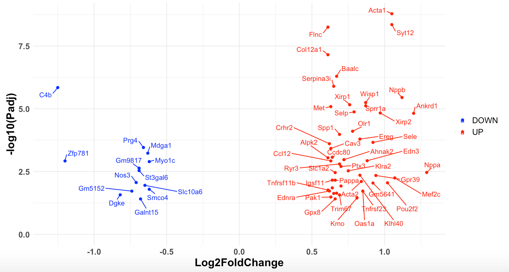

# **genomeSidekick: an epigenomic data analysis application**
##### *A simple and comprehensive method for bioinformatics beginners to visualize their data.*

### Test data can be found [HERE](https://github.com/dchapski/genomeSidekick/tree/main/test_data)

##### &nbsp;

## Introduction
The genomeSidekick data analysis tool is a simple and efficient application that allows users to analyze and visualize RNA-seq and ATAC-seq data without having to learn the nitty gritty bioinformatics. This document will provide a comprehensive overview of the functions and capabilities of each tab within the application. For your convenience, the app can be used both online as a website or locally run in your RStudio. If you run into any problems while using the app in RStudio, refer to the Troubleshooting section to see some common errors and solutions that may occur.

Please visit our GitHub page to download the source code to use in your RStudio application.

- [RNA-seq Analysis](#rna-seq-analysis)
  - [Data File Upload (RNA-seq)](#data-file-upload-(rna-seq))
  - [Interactive Volcano Plot (RNA-seq) with PubMed Search](#interactive-volcano-plot-(rna-seq)-with-pubmed-search)
  - [Top Differentially Expressed Genes](#top-differentially-expressed-genes)
- [ATAC-seq Analysis](#atac-seq-analysis)
  - [Data File Upload (ATAC-seq)](#data-file-upload-(atac-seq))
  - [Interactive Volcano Plot (ATAC-seq) with PubMed Search](#interactive-volcano-plot-(atac-seq)-with-pubmed-search)
- [Integrating RNA-seq and ATAC-seq](#integrating-rna-seq-and-atac-seq)
- [g:Profiler GO Analysis](#g:Profiler-go-analysis)
- [Troubleshooting](#troubleshooting)

## **RNA-seq Analysis**

### *Data File Upload (RNA-seq)*

You will first be asked to upload the data file containing your data in **.csv** format. Please note that the application will not accept files of other types (text, excel, etc.). Additionally, **your data table MUST have 3 core columns containing the following data: gene name, adjusted p-value, and log2FoldChange**. If the table has any additional columns, those will also be displayed although not required.

- For text files, the easiest way to convert them into .csv files is to open them in Excel, although please note that Excel can accidentally convert gene names to dates irreversibly:
  - Data tab > From Text > find file on computer > Open > select **Delimited** and **My data has headers** then click Next > select **Tab** and click Next > Finish > OK
- Then, to convert an Excel spreadsheet into a .csv file, simply click **Save As** and for File Format, choose **CSV UTF-8 (Comma delimited) (.csv)**.

Before uploading your desired file, choose the type of separation your data uses. Most of the time, .csv files are comma separated, but on the rare occasion that your .csv file happens to be separated by tabs or semicolons, you can indicate that by clicking the appropriate radio button. Select the **Browse** button to choose a file saved on your computer. Once you open the file, it will be automatically be generated in the app. Here is what it might look like:

We generally recommend using [DESeq2](https://bioconductor.org/packages/release/bioc/manuals/DESeq2/man/DESeq2.pdf) to analyze RNA-seq data and find your differentially expressed genes. DESeq2 will also return a column titled padj, which will be your adjusted p-value that you will use with genomeSidekick, in addition to the pvalue column. This will be an important distinction for your analysis, especially when you generate the volcano plots on the second tab of this app. For more information on the difference between the two and how they are calculated see [here](https://www.biostars.org/p/415023/).

The default setting in the app automatically loads the first 10 rows in your data file, but you can choose for genomeSidekick to show up to 100 rows at a time. You may see the rest of the genes by going to the bottom right corner and clicking the Next button or simply the corresponding number. There is also a search function included where you can enter any word or number that appears within your file. However, please be aware that if you search for a chromosome number (i.e. 19), the search will return all rows with a number "19" in it. For example, if a gene is on chromosome 1 but has a p-value of 0.8197, this row will be included. If you would like to see all genes on the same chromosome grouped together, the best method would be to click the column name for your chromosome column and the application will automatically sort the rows by chromosome. You can toggle between ascending or descending order by clicking on the column title again. Other column names also work similarly and will allow you to sort by value.  

If you would like upload and analyze a different data set, simply click the **Browse** button again and choose your new data set.

### *Interactive Volcano Plot (RNA-seq) with PubMed Search*

*Please note: the more genes you have (the larger your data set), the longer it will take for the application to generate the graphs, so please do not be concerned if nothing happens immediately after you click **Submit**! Just wait patiently, and the graphs will appear soon :)*

Once you have uploaded a desired set of RNA-seq data, you can now generate two volcano plots that will help you visualize your data. The panel on the left will prompt you to choose&mdash;from a list of your data table's columnn names&mdash;the columns that contain 1) the gene names, 2) the log2FoldChange values, and 3) your adjusted p-value (padj). To designate whether your gene is up regulated, down regulated, or has no change, you can adjust the significance threshold for both log2FoldChange and p-value with the sliding bars. After you have chosen the relevant columns and adjusted the thresholds to your desired values, click **Submit** and two graphs will be generated:

**Graph 1**

The first graph will plot all of the genes from your table, and based on the thresholds you set with the sliding bars, it will designate each gene as down regulated (DOWN - blue), no significant change (NO - gray), or up regulated (UP - red). The x-axis is the log2FoldChange, and the y-axis is the -log10 adjusted p-value. If you hover over any of the points, the graph will show more details including the gene name, -log10 adjusted p-value, and the log2FoldChange:

Furthermore, you can choose to do a search for your gene in either NCBI, [UniProt](https://www.uniprot.org) ([paper here](https://pubmed.ncbi.nlm.nih.gov/33237286/)), or the [Human Protein Atlas](https://www.proteinatlas.org) ([paper here](https://pubmed.ncbi.nlm.nih.gov/25613900/)) by making a selection for the database using the dropdown menu under "Choose Your Database for Searching" and then directly clicking on the gene of interest from the graph.

You may also directly search for one or multiple genes of interest using the "Input Gene's Name to Search on Plot." Type in your gene name and press enter or directly click on the gene name after it appears in the suggested matches and it will be added to the search box. The legend will automatically change to show your target genes in red and non-target genes in blue. An example would look like this:

If you would like to hide all of the non-target genes from the graph, you may click on "Non-target."

To bring the hidden non-target genes back to the graph, click on the label in the legend again. You may notice that in this case, only the gene *Aspm* is displayed on the plot even though we also searched for *Gm10193* and *Serpinb10*. This is because they do not have an associated fold change value on the data table and thus, the application is unable to generate a corresponding dot for it on the plot. This is discussed in the paper and elsewhere.

You will also notice that when you search for a certain gene or a set of genes, the five most recent PubMed articles containing that gene will be displayed in a table for you. The table will include the PubMed ID of the paper, year, title, journal, first and last name of the first author, and the beginning of the paper's abstract. As with the table on the RNA-seq data upload page, you can choose how many entries to show at once and move from one part of the table to the next using the buttons on the bottom right to navigate. If any entry looks interesting, you can click on the PubMed hyperlink and paste in the PubMed ID that is provided for the paper. Although it may take some time, this function generally works very well.

If you search for a gene that does not appear in PubMed (*e.g.*, many of the gene names that start with "Gm"), the application will return an empty row with just the gene name in it.

Finally, click the "Reset" button to clear your selection and bring your graph back to its original appearance (*i.e.*, the first picture under Graph 1).

**Graph 2**

The second graph shows only those genes designated as up or down regulated by your log2FoldChange and adjusted p-value thresholds. Unlike the first graph, this one is non-interactive and serves only as a quick way for you to get a sense of the most differentially expressed genes without having to hover over each one to see the name since the gene name is automatically generated for convenience here.

### *Top Differentially Expressed Genes*

There are two main functions on this page. First, genomeSidekick will automatically filter out your up- and down regulated genes into separate tables based on the thresholds you set on the Interactive Volcano Plot page. These tables have the same functionalities as the table on the Data File Upload page. You can search for a gene of interest, toggle between pages of the table, change how many rows are shown at a time, and reorder the rows by clicking a column name.

Second, you can download these tables as a CSV file or a TSV (tab-separated values). Simply choose which table (UpDEG for up regulated differentially expressed genes or DownDEG for down regulated) from the drop down menu on the top, select your preferred file type, and click **Download**. Once they are finished downloading, you can open the TSV file (same instructions under [Data File Upload (RNA-seq)](#data-file-upload-(rna-seq))) or CSV file in excel.

## ATAC-seq Analysis

### *Data File Upload (ATAC-seq)*

Data upload here essentially works the exact same way as data upload for RNA-seq:

You will first be asked to upload the data file containing your data in **.csv** format. Please note that the application will not accept files of other types (text, excel, etc.). Additionally, **your data table MUST have 3 core columns: gene name, adjusted p-value, and log2FoldChange**. If it has any additional columns, those will also be displayed but they are not required.

- For text files, the easiest way to convert them into .csv files is to open them in Excel, although please note that Excel can accidentally convert gene names to dates irreversibly:
  - Data tab > From Text > find file on computer > Open > select **Delimited** and **My data has headers** then click Next > select **Tab** and click Next > Finish > OK
- Then, to convert an Excel spreadsheet into a .csv file, simply click **Save As** and for File Format, choose **CSV UTF-8 (Comma delimited) (.csv)**.

Before uploading your desired file, choose the type of separation your data uses. Most of the time, .csv files are comma separated, but on the rare occasion that your .csv file happens to be separated by tabs or semicolons, you can indicate that by clicking the appropriate radio button. Select the **Browse** button to choose a file saved on your computer.

The table that is automatically generated with your data has the same exact layout and functions as described for the table in [Data File Upload (RNA-seq)](#data-file-upload-rna-seq) Here is what it may look like.

Notice that again, we have the same missing Fold change values for some of the genes. This is okay as long as it is missing for both the RNA-seq data AND the ATAC-seq data. Otherwise, there will be problems when you try to integrate the two data sets.

**Please note:** you can also upload ChIP-seq data here and perform the same visualization with the volcano plot as long as the table contains columns showing the same data (gene name, adjusted p-value, and log2FoldChange).

### *Interactive Volcano Plot (ATAC-seq) with PubMed Search*

*Please note: the more genes you have (the larger your data set), the longer it will take for the application to generate the graphs, so please do not be concerned if nothing happens immediately after you click **Submit**! Just wait patiently, and the graphs will appear soon :)*

Here, you can generate the same two types of graphs that were available for RNA-seq. Again, the panel on the left will prompt you to choose from a list of your data table's column names the columns that contain 1) the gene names, 2) the log2FoldChange values, and 3) your adjusted p-value (padj). To designate whether your gene is up regulated, down regulated, or has no change, you can adjust the significance threshold for both log2FoldChange and p-value with the sliding bars. After you have chosen the relevant columns and adjusted the thresholds to your desired values, click **Submit** and two graphs will be generated.

The pictures below show what your graphs might look like after they are generated.

As with the RNA-seq interactive volcano plot page, you may click on any of the dots on the first graph to search in NCBI, Uniprot, or the Human Protein Atlas. You can also search for genes on the volcano plot and PubMed results will automatically be generated.

## Integrating RNA-seq and ATAC-seq

On this page, the application integrates RNA-seq and ATAC-seq data from the same experiment, as long as the two datasets have a column name in common (*e.g.*, gene_name). Once you have uploaded the relevant data files into the RNA-seq and ATAC-seq data file upload pages, the application will be able to generate a graph that integrates all of the information. Please note that you must also have already generated the volcano plots for both data sets (on their corresponding tabs in the application) before the integration can work. You may choose which set of data you would like to use as the base graph&mdash;RNA-seq or ATAC-seq&mdash;by selecting the corresponding radio button at the top. As with the interactive volcano plots for RNA-seq and ATAC-seq data alone, you can click on a point of interest from the graph and it will automatically take you to the NCBI, Uniprot, or Human Protein Atlas (your choice from the Database dropdown menu) page for that gene. Here is an example of what it might look like.

RNA-seq as the base:

ATAC-seq as the base:

Additionally, just like the interactive volcano plots, if you hover over one of the dots, you will be able to see the gene name and the specific log2FoldChange and -log10 p-value associated with that gene from the base graph.

## g:Profiler GO Analysis

The g:Profiler tab of this application allows you to use g:Profiler to characterize and manipulate your gene data. It essentially performs statistical enrichment analysis to interpret the information on the genes you provided and returns data such as Gene Ontology terms, biological pathways, regulatory motifs of transcription factors, human disease annotations and protein-protein interactions. You can [read more about g:Profiler](https://biit.cs.ut.ee/gprofiler/page/docs) on their website to develop a better understanding of the program.

First, you will be asked to choose the gene list you want to study: either the Upregulated genes, Downregulated genes, or both Upregulated and Downregulated. Then, you can choose your organism of interest from either Human, Mouse, or Rat. It is important to choose the correct organism because it defines the organism where the input genes, proteins and probes belong to. At this point, you may notice that the **Ordered Query** box is checked by default. This is because g:Profiler may interpret your list as an ordered list where elements (*i.e.*, genes) are in the order of decreasing importance. The ordered query option is useful when the genes can be placed in some biologically meaningful order. In our case, genes would be ordered according to differential expression values gathered from your RNA-seq experiment. Next, the Statistical Domain Scope allows you to choose the effective genomic landscape for statistical testing and the Significance Threshold will allow you to choose which multiple testing correction method you prefer. For more information on the differences between each method, visit the **Significance threshold** section on this [website](https://biit.cs.ut.ee/gprofiler/page/docs). Lastly, you can choose either the log2FoldChange or adjusted p-value to select your top significant genes and move the slider to change the number of genes that are included from your list.

As with the volcano plots from before, the more genes you have (the larger your data set), the longer it will take for the application to generate the results, so please be patient after you click **Submit**. The application will generate two outputs: an interactive Manhattan plot that illustrates the enrichment analysis results and a table that lists the details of each point generated on the plot. The x-axis of the plot represents functional terms that are grouped and color-coded by data sources. For example, the Molecular Function from Gene Ontology analysis is red (first column in the figure below). The y-axis shows the adjusted enrichment p-values on a -log10 scale. As with the interactive volcano plots, hovering over each dot will allow you to view the corresponding information. The number behind the source name in the labels shows how many significantly enriched terms there were from this source. Additionally, the circle sizes are chosen in accordance with the corresponding term size (larger terms have larger circles), and terms from the same Gene Ontology subtree are located closer to each other.

## Troubleshooting

Besides running the application through the URL online, you can also run it locally through your RStudio application. Simply download the script from out Github page and open the app.R file in RStudio. It will be one signel file, and everything you need will be in there.

### 1. *How to Download R and RStudio*

If you are completely new to R, you can download R on [macOS](https://cran.r-project.org/bin/macosx/) systems or [Windows](https://cran.r-project.org/bin/windows/) by following the instructions listed on the website. Then, you can also download RStudio from [here](https://www.rstudio.com/products/rstudio/download/#download). The free desktop version will work just fine. Once you click download, it will allow you to choose which operating system you have.

### 2. *How to Run the Script*

Before you run the script, make sure you have all relevant dependencies downloaded and installed. In other words, install all of the packages that are used in the script. You will find a list of all of the packages needed for the application to run at the very top of the script. The package names are the words inside **library()**. If you just downloaded R and RStudio by following the instructions from Troubleshooting Section 1, or you already have them installed but never used RStudio before, oftentimes, a line of text will appear at the top of the RStudio window (akin to an announcement bar) right after you open the `app.R` file. It will ask if you want to install all the dependencies for the app, so just click **install**. Alternatively, you can use the command **install.packages()** and put the package name inside the parentheses along with quotes. For example, if you see `library(ggplot2)` and you want to download the ggplot2 package, simply run the command `install.packages("ggplot2")` in the console on RStudio. You will know when it is done when it says **Done** and the **>** arrow appears again.

Once you have all of the dependencies installed, you can now run the app. Simply go to the upper right hand corner of the file and click the green play button next to the words **Run App**. RStudio automatically recognizes the script as a Shiny application script, so it will provide the run button for you.

### 3. *Issues with Installing Packages*

It is very common to run into issues while installing R packages. Sometimes your R version might be too old or some other dependency might need to be installed first before the one you are trying to install can install successfully. An indicator that something has gone wrong during your package installation is if you see any **Error** messages or the automatically generated messages end with a non-zero exit status. Listed below are some common issues that you might run into and solutions for them.

1. **The error message tells you your version number is too old**

   In the even that you already have RStudio installed on your computer from years ago, this might become a problem for you. You can manually update RStudio by going to the **Help Menu** and clicking on **Check for Updates** (on Macs, this is the top bar along the same horizontal as the apple in the left corner, not within the RStudio window). RStudio will then check and ask if you want to update to the newest version. Alternatively, you can just download the newest version using the same method mentioned in Troubleshooting Section 1, and it will replace the old version. The only caveat to updating RStudio is that if you already have previous code that runs well on the old version, updating may change some dependencies and cause it to stop working. However, if you are new to RStudio or do not have old work on there, then there should be no additional problems.

2. **You are unable to install the ggrepel package on Mac**

   If you have never used RStudio before or you have no attachment to the work you have done on RStudio before, then the easiest way to resolve this is to delete the application completely and download the newest version by following the instructions listed under Troubleshooting Section 1.

   If deleting and reinstalling is not an option for you, you can try the following steps:

   1. For Mac users, install [Xcode command line tools](https://stackoverflow.com/questions/9329243/how-to-install-xcode-command-line-tools) from the terminal
   2. Install [Homebrew](https://docs.brew.sh/Installation) from the terminal
   3. Try to run the application again and see if the error persists
   4. If the error is still there, try running: `remotes::install_github(“slowkow/ggrepel”)` in your RStudio console and then try to run the application again
   5. If the error still persists, you may want to consider reinstalling RStudio

If your error message is not listed here or you tried our solution and you still have problems, the best way to get more help is to copy and paste the error message from the RStudio console into Google. Often times, people everywhere have had the same problem as you, and others have already helped them solve it. Websites like Stack Overflow are the most commonly helpful places to get answers. Finally, if you still cannot resolve things, consult your local bioinformatician for help.

### 4. *Changing the Script*

For more advanced users, you may want to change how the application functions to better suit your needs. You can freely modify the user interface and server portions of the script to change the appearance of the app, add new functions, and much more. To get a sense of how R Shiny works, feel free to visit [this website](https://shiny.rstudio.com/tutorial/) for quick and easy tutorials.

### 5. *Other Problems*

If you encounter any problems while using our application (i.e. one of the functions stops working like it should), please feel free to reach out to us by emailing the corresponding author.
